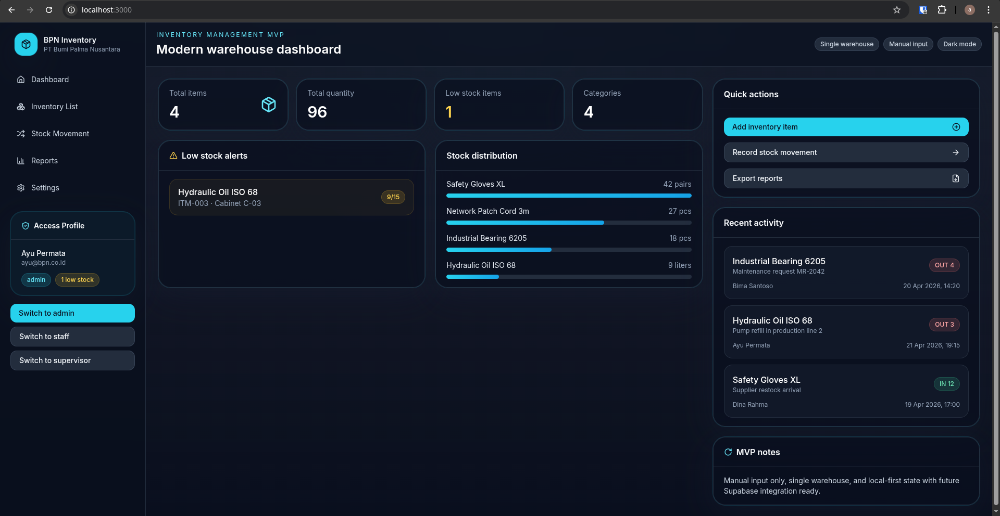

<h1 align="center">BPN Inventory Dashboard</h1>

<p align="center">
  
  
  
  
  
</p>

<p align="center">
  Inventory management dashboard with manual item input, stock movement tracking, role switching, and export-ready reports.
</p>

## 🔎 Project overview

BPN Inventory Dashboard is a dark-mode inventory management MVP built with Next.js App Router.
It is designed for single-warehouse internal operations and focuses on the core workflows needed to track items, monitor stock levels, and review movement history.

The app currently uses local mock data and is structured to be ready for future Supabase integration.

## 📸 Showcase

<p align="center">
  
</p>

## ⭐ Main features

- Dashboard with summary cards, low-stock alerts, recent activity, and a chart
- Inventory list with search, category filtering, view/edit/delete actions
- Add and edit inventory items
- Stock movement records for stock in and stock out
- Role switching for admin, staff, and supervisor views
- Export reports to CSV and Excel
- Print-friendly report view that can be saved as PDF from the browser
- Dark, enterprise-style UI built with reusable components

## 🧱 Tech stack

- Next.js 16 App Router
- React 19
- TypeScript
- Tailwind CSS
- shadcn/ui-style reusable UI components
- Lucide React icons
- xlsx for spreadsheet export
- Future-ready Supabase configuration

## 📁 Detailed repository structure

```txt
inventorymvp-ptsawit/
├── src/
│   ├── app/
│   │   ├── page.tsx                # Dashboard
│   │   ├── inventory/              # Inventory list, detail, create pages
│   │   ├── movement/               # Stock movement page
│   │   ├── reports/                # Export and print view
│   │   └── settings/               # Placeholder settings page
│   ├── components/
│   │   ├── app-shell.tsx           # Sidebar and top-level layout
│   │   ├── inventory-provider.tsx  # Local inventory state
│   │   ├── inventory-chart.tsx    # Dashboard chart
│   │   └── ui.tsx                 # Shared UI primitives
│   └── lib/
│       ├── mock-data.ts            # Seed data
│       ├── report-export.ts        # CSV/XLSX export helpers
│       ├── supabase.ts             # Supabase client placeholder/setup
│       ├── types.ts                # TypeScript models
│       └── utils.ts                # Helpers and formatters
├── .env.example
├── .gitignore
├── next.config.mjs
├── package.json
├── tailwind.config.ts
└── README.md
```

## 🧑‍💻 Requirements

- Node.js 20+ recommended
- npm
- Git
- Optional: Supabase project for later integration

## ⚙️ Local setup

1. Clone the repository.
2. Install dependencies:

```bash
npm install
```

3. Copy the example environment file:

```bash
cp .env.example .env.local
```

4. Fill in the values in `.env.local`.
5. Start the development server:

```bash
npm run dev
```

## 🌍 How to get the repository

### Recommended: git clone

```bash
git clone https://github.com/Alief1150/inventorymvp-ptsawit.git
cd inventorymvp-ptsawit
```

### Download with curl

```bash
curl -L -o inventorymvp-ptsawit.zip https://github.com/Alief1150/inventorymvp-ptsawit/archive/refs/heads/main.zip
unzip inventorymvp-ptsawit.zip
cd inventorymvp-ptsawit-main
```

### Download with wget

```bash
wget -O inventorymvp-ptsawit.zip https://github.com/Alief1150/inventorymvp-ptsawit/archive/refs/heads/main.zip
unzip inventorymvp-ptsawit.zip
cd inventorymvp-ptsawit-main
```

## 🪟 Windows setup

Use PowerShell, Windows Terminal, or Git Bash.

1. Clone or download the repo.
2. Install dependencies:

```powershell
npm install
```

3. Create the local env file:

```powershell
Copy-Item .env.example .env.local
```

4. Edit `.env.local` and add your Supabase values if needed:

```env
NEXT_PUBLIC_SUPABASE_URL=
NEXT_PUBLIC_SUPABASE_ANON_KEY=
NEXT_PUBLIC_SUPABASE_PROJECT_ID=
```

5. Start the app:

```powershell
npm run dev
```

## 🐧 Linux setup

Works on Ubuntu, Debian, Arch, Fedora, Mint, and other Linux distributions.

1. Clone or download the repo.
2. Install dependencies:

```bash
npm install
```

3. Create and edit the local env file:

```bash
cp .env.example .env.local
nano .env.local
```

4. Put your runtime values in the project root `.env.local` file.
5. Run locally:

```bash
npm run dev
```

## 🔐 Environment variables

The current example environment file includes:

- `NEXT_PUBLIC_SUPABASE_URL`
- `NEXT_PUBLIC_SUPABASE_ANON_KEY`
- `NEXT_PUBLIC_SUPABASE_PROJECT_ID`

Important:

- Do not commit `.env.local`
- Keep secrets out of the repository
- Use only public client-safe values in browser code

## 📦 Release notes

See the release notes folder if you add versioned changelogs later.

## 📝 Notes

- The app currently uses local/mock state for the MVP.
- Inventory is optimized for a single warehouse.
- Manual item input is the primary workflow.
- CSV, Excel, and print-to-PDF exports are available from the Reports page.
- Add screenshots or branding assets in an `assets/` folder if you want a richer README later.
